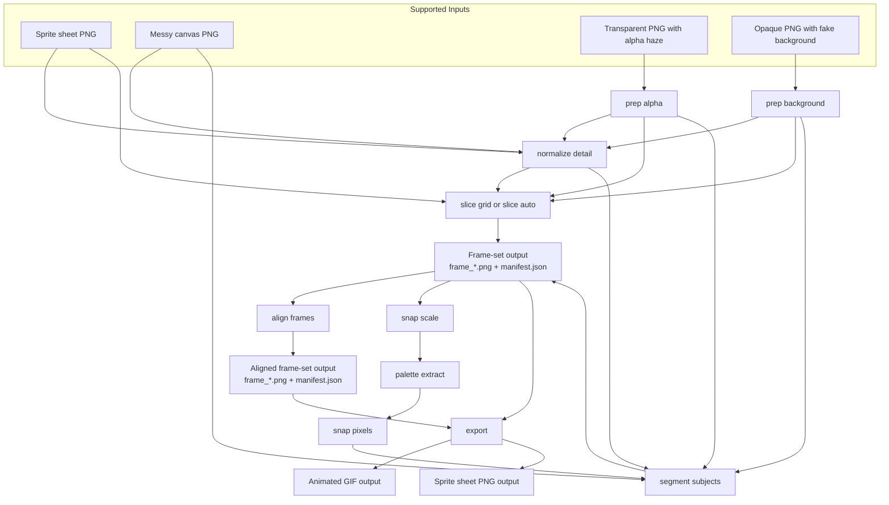

# sprite-gen

Minimal Go CLI for cleaning up AI-generated pixel art and exporting it to game-engine-native formats.

## Pipeline



## Build

```bash
go build ./cmd/sprite-gen
```

## Test

```bash
go test ./...
```

## Commands

Inspect a whole sheet and let the CLI guess a grid:

```bash
sprite-gen inspect sheet ./sheet.png
```

Inspect a single frame and report bbox and a simple feet pivot hint:

```bash
sprite-gen inspect frame ./frame.png --json
```

`inspect frame` ignores ultra-low-alpha stray pixels by default when
computing the bbox and pivot. Tune it for softer assets with:

```bash
sprite-gen inspect frame ./frame.png --alpha-threshold 1 --json
```

Extract a palette from a PNG to the deterministic default output path:

```bash
sprite-gen palette extract ./sheet.png --max 16
```

Generated outputs are grouped by subject and processing stage under `out/`.
For example, running `snap scale` on `slime3.png` writes to
`out/slime3/snap/native.png`.

Use `--out -` when you want `palette extract` on stdout for piping.

Apply a palette and write to the deterministic default output path:

```bash
sprite-gen palette apply ./sheet.png --palette ./palette.hex
```

Remove soft alpha edges, then snap the remaining visible pixels to a palette:

```bash
sprite-gen snap pixels ./sheet.png --palette ./palette.hex --alpha-threshold 128
```

Clear low-alpha background haze from a generated transparent PNG before
attempting to slice it:

```bash
sprite-gen prep alpha ./sheet.png --alpha-threshold 128
```

Remove a fake or opaque background without leaving the CLI:

```bash
sprite-gen prep background ./sheet.png --method auto
```

Use `prep background` for flat keyed or edge-connected opaque backgrounds.
`--method auto` chooses `key` when `--color` is provided and `edge` otherwise.
Use `prep alpha` when the PNG already has real transparency and just needs its
low-alpha haze cleaned up.

Detect and undo integer nearest-neighbor upscaling:

```bash
sprite-gen snap scale ./sheet.png --factor auto
```

Normalize a single PNG toward a project detail target without overloading
`snap scale`:

```bash
sprite-gen normalize detail ./sheet.png --target-height 48
```

`normalize detail` is an optional project-consistency step for single-image
inputs. It only chooses integer downscale factors, measures the visible subject
bbox with `--alpha-threshold`, and leaves the image unchanged when the requested
target would otherwise require upscaling.

Slice a clean sprite sheet into per-frame PNGs plus `manifest.json`:

```bash
sprite-gen slice grid ./sheet.png --cols 4 --rows 1
```

Auto-detect a gutter-separated sheet grid and write the same frame-set output:

```bash
sprite-gen slice auto ./sheet.png --min-gap 1
```

Segment a messy generated canvas into normalized frame cells when the model
ignored the requested sheet layout:

```bash
sprite-gen segment subjects ./messy_canvas.png --cell 32x32 --expected 4 --anchor feet
```

`segment subjects` thresholds alpha, optionally erodes or dilates the binary
mask, labels connected components, filters out small speckles, and writes the
same `frame_NNN.png` plus `manifest.json` contract as `slice`.

Align a sliced or segmented frame-set onto a shared pivot before export:

```bash
sprite-gen align frames ./out/knight/slice --anchor feet
```

`align frames` writes every output frame onto a shared canvas and updates
`manifest.json` so each frame has the same output-space `pivot`.

Export an aligned or sliced frame-set to an animated GIF preview:

```bash
sprite-gen export ./out/knight/align --format gif --fps 8 --scale 2
```

Pack a frame-set back into a single sprite-sheet PNG:

```bash
sprite-gen export ./out/knight/align --format sheet-png --cols 4
```

Use `sprite-gen export --list-formats` to discover registered output formats.
`sheet-png` writes only the PNG artifact named by `--out`; it does not emit a
companion `manifest.json`. When input frames have mixed sizes, it pads them into
the largest cell size in the packed sheet.

## Choosing A Pipeline

There are two practical cleanup paths before `export`.

Short pipeline: use this when the image mostly has a layout problem, not a color
problem.

```bash
# Transparent messy canvas
sprite-gen normalize detail ./walk.png --target-height 48
sprite-gen segment subjects ./out/walk/normalize/detail.png --anchor feet
sprite-gen align frames ./out/walk/segment --anchor feet
sprite-gen export ./out/walk/align --format gif --fps 8 --scale 2

# Opaque fake background first
sprite-gen prep background ./walk.png --method auto
sprite-gen normalize detail ./out/walk/prep/background.png --target-height 48
sprite-gen segment subjects ./out/walk/normalize/detail.png --anchor feet
sprite-gen align frames ./out/walk/segment --anchor feet
sprite-gen export ./out/walk/align --format sheet-png --cols 4
```

Use the short pipeline when:
- the background is already truly transparent, or `prep background` removes it cleanly
- frame detection and alignment are the main problems
- colors already look stable enough for your target engine
- you want to preserve the source colors as much as possible

Reasons to prefer it:
- fewer destructive operations
- faster iteration
- less chance of flattening deliberate shading or changing the look of the art
- `normalize detail` can optionally make mixed-source assets converge on a more consistent visible subject height before slicing or segmenting

Full pipeline: use this when the image also has cleanup or palette problems.

```bash
sprite-gen prep background ./walk.png --method auto
sprite-gen snap scale ./out/walk/prep/background.png --factor auto
sprite-gen palette extract ./out/walk/snap/native.png --max 32
sprite-gen snap pixels ./out/walk/snap/native.png --palette ./out/walk/palette/extracted-32.hex
sprite-gen normalize detail ./out/walk/snap/snapped.png --target-height 48
sprite-gen segment subjects ./out/walk/normalize/detail.png --anchor feet
sprite-gen align frames ./out/walk/segment --anchor feet
sprite-gen export ./out/walk/align --format gif --fps 8 --scale 2
```

Use the full pipeline when:
- the image has glow, soft anti-aliased fringes, or many near-duplicate colors
- animation frames shimmer because the generator drifted between similar colors
- the GIF preview still looks noisy after a short pipeline run
- you want a stricter, game-ready limited palette before export

Reasons to prefer it:
- `snap pixels` can remove low-alpha junk and collapse noisy colors into a stable palette
- limited-palette cleanup often makes GIF previews look cleaner and easier to review
- consistent colors across frames usually survive later export steps better

Caveats:
- `snap scale` only helps when the source was truly integer-upscaled; on native-size art it is often a no-op
- `normalize detail` is intentional style normalization, not corrective upscale detection; use it only when you want assets to converge toward a shared detail budget
- `palette extract` learns from the current pixels, so if the source still contains edge contamination or background residue, the extracted palette can preserve those bad colors
- on fully opaque generated images, run `prep background` first and visually inspect the result before extracting a palette
- if you see a bright fringe or white outer layer after the full pipeline, the cleanup step likely left contaminated edge colors behind; try improving background removal first or use a curated palette instead of extracting one from the dirty image

In practice: start with the short pipeline. Move to the full pipeline when visual review shows color noise, edge haze, or palette drift that the short pipeline does not fix.

Compare two frame PNGs and write a red-overlay diff image:

```bash
sprite-gen diff frames ./frame_000.png ./frame_001.png --json
```

`diff frames` pads mismatched image sizes with transparency for comparison and
reports the mismatch in structured output.

`slice grid --trim` writes trimmed PNGs and records the trimmed source rect in
`manifest.json`, so downstream commands still know where each frame came from in
the original sheet.

For generated sprite sheets, ask for a fully transparent background, explicit
frame count and layout, fixed cell size, and transparent gutters between cells.
Avoid glow, floor shadows, blur, text, and borders. Even with a good prompt,
`prep alpha` helps clean residual background haze before `slice`. If the model
painted a fake or opaque background instead, run `prep background` first; a
truly messy canvas still belongs to `segment subjects`.

List the registered command surface:

```bash
sprite-gen spec --markdown
```

## Install

```bash
go install ./cmd/sprite-gen
```

Install the latest tagged release:

```bash
go install github.com/kkjang/sprite-gen/cmd/sprite-gen@latest
```

Install a specific release:

```bash
go install github.com/kkjang/sprite-gen/cmd/sprite-gen@v0.1.0
```

## Release process

1. Open a small PR that bumps `sprite-gen` in `releases.yaml`.
2. Merge after CI passes.
3. The `Release` workflow runs after `CI` succeeds on `main`, then creates the tag and GitHub Release.

Tags use plain semver like `v0.1.0`.
